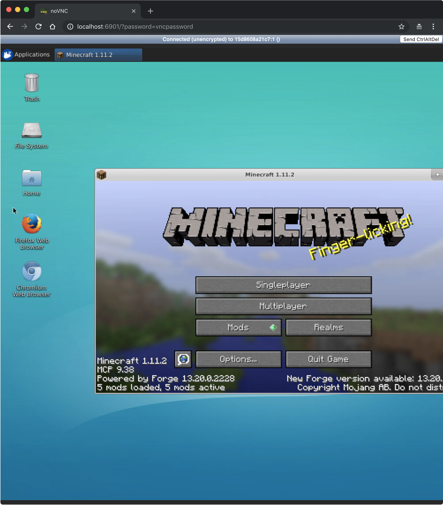

# MarLo Handson

## Requirement

For the content of this repository, you need
- Python 3.5+ environment with
    - Chainer v5.0.0
    - CuPy v5.0.0
    - ChainerRL v0.4.0
    - marlo v0.0.1.dev23

To follow the instruction below, you need
- Azure subscription

## Setup

### 1. Install the Azure CLI tool

```
$ pip install azure-cli
```

### 2. Login to Azure using the Azure CLI

```
$ az login
```

### 3. Select a subscription

List up all the subscriptions you have by
```
$ az account list --all
```

Then, specify one of them with
```
$ az account set --subscription [A SUBSCRIPTION ID]
```
Of cource you need to replace `[A SUBSCRIPTION ID]` with a specific ID you want to use.

### 4. Launch a GPU VM

First, you have to create a resource group:
```
$ az group create -g marLo-handson -l eastus
```

Next, let's cerate a data science VM:
```
$ az vm create \
--resource-group marLo-handson \
--name vm \
--admin-username ${USER} \
--public-ip-address-dns-name ${USER} \
--image microsoft-ads:linux-data-science-vm-ubuntu:linuxdsvmubuntu:latest \
--size Standard_NC6 \
--generate-ssh-keys
```

Then, you will see the message like following:
```
{
  "fqdns": "[YOUR USERNAME].eastus.cloudapp.azure.com",
  "id": "/subscriptions/[YOUR SUBSCRIPTION ID]/resourceGroups/marLo-handson/providers/Microsoft.Compute/virtualMachines/vm",
  "location": "eastus",
  "macAddress": "AA-BB-CC-DD-EE-FF",
  "powerState": "VM running",
  "privateIpAddress": "10.0.0.4",
  "publicIpAddress": "123.456.78.910",
  "resourceGroup": "marLo-handson",
  "zones": ""
}
```
Please do not care some slight differences. All you need is the `publicIpAddress` of the created VM.

### 5. SSH to the VM

```
$ ssh [IP OF THE VM]
```

Please replace `[IP OF THE VM]` with your IP address you can find in the result of the previous step.

### 6. Setup the VM

On the VM,
```
$ git clone https://github.com/mitmul/marlo-handson && \
bash marlo-handson/setup.sh
```

### 7. Port forwarding via SSH

On your local machine,
```
$ ssh [IP OF THE VM] -L 6901:localhost:6901
```

### 8. Open the virtual desktop

Then please open this URL with your browser: http://localhost:6901/?password=vncpassword

You'll see the virtual desktop in the browser window and the Minecraft working in it.


